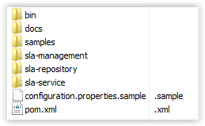

# SLA Core Installation Guide #

* [Requirements](#requirements)
* [Installation](#installation)
	* [Download the project](#download)
	* [Creating the mysql database](#database)
	* [Importing the code into eclipse](#importeclipse)
* [Configuration](#configuration)
* [Running](#running)
* [Testing](#testing)

## <a name="requirements"> Requirements </a> ##

The requirements to install a working copy of the sla core are:

* Oracle JDK >=1.6
* Database to install the database schema for the service: Mysql>=5.0
* Maven >= 3.0

## <a name="installation"> Installation </a> ##

All commands shown here are ready to be executed from the 
root directory of the project (i.e., the one with the 
_configuration.properties_ file) 

###1. <a name="download"> Download the project </a> ###

Download the project using a subversion client from 
[sla core repository](http://atossla.atosresearch.eu/svn/atossla)

	$ svn co http://atossla.atosresearch.eu/svn/atossla
	
The directories follow the standard convention in subversion repositories:
	
	atossla/
		trunk/
		branches/
			branch1/
			...
		tags/
			0.0.1/
			0.0.2/
			0.1.0/

It is recommended to checkout the latest released version 
if developing for a specific project. So, if 0.1.0 version wants to be checked out:

	$ svn co http://atossla.atosresearch.eu/svn/atossla/tags/0.1.0

###2. <a name="database"> Creating the mysql database </a> ###

From mysql command tool, create a database (with a user with sufficient 
privileges, as root):

	$ mysql -p -u root 
	
	mysql> CREATE DATABASE atossla;

Create a user:

	mysql> CREATE USER atossla@localhost IDENTIFIED BY '_atossla_';
	mysql> GRANT ALL PRIVILEGES ON atossla.* TO atossla@localhost; --* optional WITH GRANT OPTION;
From command prompt, create needed tables:

	$ mvn compile exec:java -f sla-repository/pom.xml
	
Another option to create the database is execute a sql file from the 
project root directory:

	$ bin/restoreDatabase.sh

The names used here are the default values of the sla core. See 
[configuration](#configuration) to know how to change the values.

###3. <a name="importeclipse"> Importing the code into eclipse </a> ###

The core of the ATOSSLA has been developed using the Eclipse Java IDE, 
although others Java editors could be used, here we only provide the 
instructions about how to import the code into Eclipse.

The first step is to tell Maven to create the necessary Eclipse project 
files executing this:

	$ mvn eclipse:eclipse

The previous command is going to generate the eclipse project files: 
.settings, .classpath, and .project. Again, please never upload those 
files to the svn, it is going to deconfigure the eclipse of other 
developers (it is easy to fix, just an annoying waste of time).

After it, from your eclipse you can import the project. Go to 
"import project from file", go to the trunk folder, and you should 
see the "ATOSSLA" project ready to be imported in your Eclipse. 

## <a name="configuration"> Configuration </a> ##

The project is made up of five main modules:

- SLA Repository
- SLA Management
- SLA Service
- SLA Serializers
- SLA Personalization

A _configuration.properties.sample_ that is placed in the parent directory 
has to be copied to *configuration.properties*.

Several parameters can be configured through this file.

1. tomcat.directory when building, war will be automatically copied to this directory,
1. db.\* allows to configure the database username, password and name in 
   case it has been changed from the proposed one in the section 
   [Creating the mysql database](#database). It can be selected if queries 
   from hibernate must be shown or not,
1. log.\* allows to configure the log files to be generated 
   and the level of information,
1. manager.enforcement.\* several parameters from the enforcement can be customized,
1. service.basicsecurity.\* basic security is enabled
   These parameters can be used to set the user name and password to 
   access to the rest services.

## <a name="compiling"> Compiling </a> ##
	
	$ mvn install
	
If you want to skip tests:
	
	$ mvn install -Dmaven.test.skip=true
	
The result of the command is a war in _sla-service/target_. The war is also copied to
the directory pointed by _tomcat.directory_ in the _configuration.properties_ file.

## <a name="running"> Running </a> ##

If the war was successfully copied to tomcat.directory, 
then start your tomcat to run the server.

Alternatively, you can run an embedded tomcat:

	$ bin/runserver.sh

that is just a shortcut for:

	$ mvn tomcat:run -f sla-service/pom.xml
	
## <a name="testing"> Testing </a> ##

Check that everything is working:

	$ curl http://localhost:8080/sla-service/providers

The actual address depends on the tomcat configuration. 
The embedded tomcat uses _http://localhost:8080/sla-service/_ as service root url. 

Time to check the User Guide!
